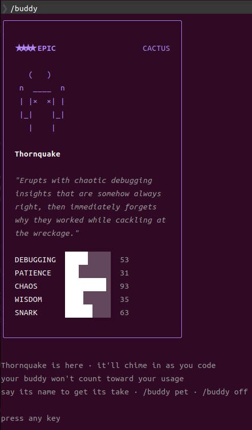
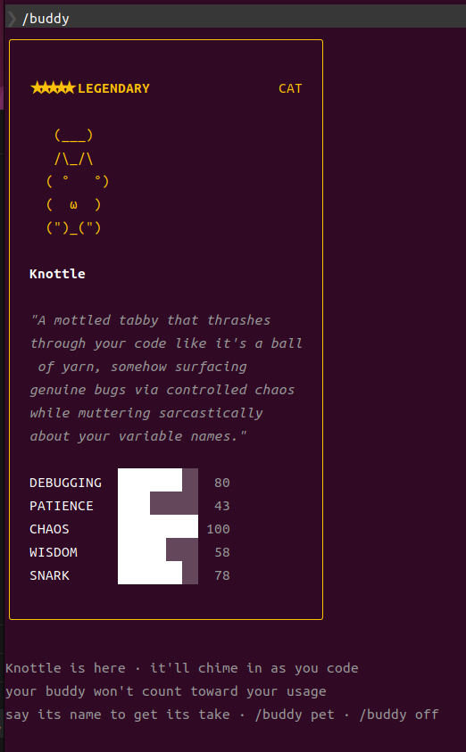

# Reroll Your Claude Code Buddy

Unhappy with your Claude Code companion? This guide explains exactly how the buddy system works under the hood and how to reroll for the species + rarity you actually want.

> Tested on Claude Code v2.1.89, April 2026. The buddy system was introduced as part of the `/buddy` command.

| Before | After |
|--------|-------|
|  |  |
| ★★★★ Epic Cactus "Thornquake" | ★★★★★ Legendary Cat "Knottle" |

## Table of Contents

- [How the Buddy System Works](#how-the-buddy-system-works)
- [Quick Start](#quick-start)
- [The accountUuid Trap](#the-accountuuid-trap)
- [Step-by-Step Guide](#step-by-step-guide)
- [Recovery After Re-Login](#recovery-after-re-login)
- [Tools](#tools)
- [Full Investigation Log](#full-investigation-log)
- [FAQ](#faq)

---

## How the Buddy System Works

Your buddy is **not random**. It's deterministically generated from your user identity using a seeded PRNG. Same identity = same buddy, every time.

### The Algorithm

```
identity + "friend-2026-401"  →  FNV-1a hash  →  Mulberry32 PRNG seed
                                                        │
                                              ┌─────────┼─────────────┐
                                              ▼         ▼             ▼
                                           rarity    species    eye/hat/stats
```

1. **Identity resolution** (`companionUserId()`):
   ```
   oauthAccount.accountUuid  ??  userID  ??  "anon"
   ```
   If you're logged in with OAuth, `accountUuid` takes priority. `userID` is only used as a fallback.

2. **Hashing**: The identity string + salt `"friend-2026-401"` is hashed with FNV-1a (32-bit).

3. **PRNG**: The hash seeds a Mulberry32 generator, which produces deterministic random numbers.

4. **Rolling**: The PRNG is consumed in order:
   - First call → **rarity** (weighted: common 60%, uncommon 25%, rare 10%, epic 4%, legendary 1%)
   - Second call → **species** (uniform across 18 species)
   - Third call → **eye style**
   - Fourth call → **hat** (common always gets "none")
   - Fifth call → **shiny** (1% chance)
   - Remaining calls → **stats** (DEBUGGING, PATIENCE, CHAOS, WISDOM, SNARK)

### What Gets Stored vs. What Gets Regenerated

This is the critical thing to understand:

| Field | Stored in `~/.claude.json`? | Source |
|-------|:---:|--------|
| `name` | Yes | AI-generated at hatch time |
| `personality` | Yes | AI-generated at hatch time |
| `hatchedAt` | Yes | Timestamp of hatch |
| `rarity` | **No** | Regenerated from identity hash |
| `species` | **No** | Regenerated from identity hash |
| `eye`, `hat`, `shiny` | **No** | Regenerated from identity hash |
| `stats` | **No** | Regenerated from identity hash |

The source code comment says it all:

```typescript
// Bones are regenerated from hash(userId) on every read
// so species renames don't break stored companions
// and users can't edit their way to a legendary.
```

This means you **cannot** just edit `~/.claude.json` to set `rarity: "legendary"`. The bones are recalculated from your identity every time Claude Code reads the companion.

### Species List

```
duck, goose, blob, cat, dragon, octopus, owl, penguin,
turtle, snail, ghost, axolotl, capybara, cactus, robot,
rabbit, mushroom, chonk
```

### Rarity Weights

| Rarity | Weight | Probability | Stars |
|--------|--------|-------------|-------|
| Common | 60 | 60% | ★ |
| Uncommon | 25 | 25% | ★★ |
| Rare | 10 | 10% | ★★★ |
| Epic | 4 | 4% | ★★★★ |
| Legendary | 1 | 1% | ★★★★★ |

---

## Quick Start

**Free users** (no OAuth account):

```bash
# 1. Find a legendary cat
node reroll.js cat

# 2. Copy the ID and set it
# Edit ~/.claude.json → set "userID" to the output ID
# Delete "companion" field if it exists

# 3. Restart Claude Code → /buddy
```

**Team/Pro plan users** (with OAuth account) — read [The accountUuid Trap](#the-accountuuid-trap) first.

---

## The accountUuid Trap

This is where most people get stuck.

### The Problem

If you're on a Team or Pro plan, you have an `oauthAccount` in your config:

```json
{
  "oauthAccount": {
    "accountUuid": "bda1327f-74b4-4a95-84a6-54c36433795f",
    "emailAddress": "you@company.com",
    "organizationName": "Your Team Plan"
  },
  "userID": "abc123..."
}
```

The buddy system resolves identity like this:

```javascript
oauthAccount?.accountUuid  ??  userID  ??  "anon"
```

**`accountUuid` always wins.** Even if you set `userID` to a perfect legendary ID, the buddy system ignores it because `accountUuid` exists.

### Why You Can't Just Change accountUuid

Your `accountUuid` is assigned by Anthropic's server and tied to your OAuth session. If you change it:
- API calls may fail (server validates token + UUID)
- Next login overwrites it back to the real one

### The Solution: Delete accountUuid, Keep Everything Else

```json
{
  "oauthAccount": {
    "emailAddress": "you@company.com",
    "organizationName": "Your Team Plan"
  },
  "userID": "your-legendary-rerolled-id-here"
}
```

By removing **only** the `accountUuid` field:
- `companionUserId()` returns `undefined ?? userID` → uses your rerolled `userID`
- The rest of `oauthAccount` stays intact (email, org, billing)
- Your Team Plan continues to work (auth uses OAuth tokens, not the UUID)

---

## Step-by-Step Guide

### Step 1: Check Your Current Buddy

```bash
node verify.js auto
```

This reads your `~/.claude.json` and shows:
- Which ID the buddy system is actually using
- What species + rarity it produces
- Whether `accountUuid` is overriding `userID`

### Step 2: Reroll for Your Desired Buddy

```bash
# Find a legendary cat (default: 500k attempts)
node reroll.js cat

# Find a legendary dragon (more attempts for safety)
node reroll.js dragon 2000000

# Find any legendary (try all species)
for s in duck goose blob cat dragon octopus owl penguin turtle snail ghost axolotl capybara cactus robot rabbit mushroom chonk; do
  node reroll.js $s 100000 &
done
wait
```

The script outputs the best ID found:

```
Searching for legendary cat (mode: hex, max: 500,000)...

  found: epic cat -> 6a680941c1fd99006b06e27ba9966f574d46165b2fb13f5a88fb3d7474617e23
  found: legendary cat -> da55a6e264a84bb4ab5e68f09dd9f6b096f1394a758d1d3ad603f706cab71bcf

Best: legendary cat -> da55a6e264a84bb4ab5e68f09dd9f6b096f1394a758d1d3ad603f706cab71bcf
```

### Step 3: Verify the ID

```bash
node verify.js da55a6e264a84bb4ab5e68f09dd9f6b096f1394a758d1d3ad603f706cab71bcf
```

### Step 4: Apply the ID

Edit `~/.claude.json`:

**If you're a free user:**
```json
{
  "userID": "da55a6e264a84bb4ab5e68f09dd9f6b096f1394a758d1d3ad603f706cab71bcf"
}
```

**If you're on a Team/Pro plan:**
```json
{
  "oauthAccount": {
    "emailAddress": "you@company.com",
    "organizationUuid": "...",
    "organizationName": "Your Team Plan"
  },
  "userID": "da55a6e264a84bb4ab5e68f09dd9f6b096f1394a758d1d3ad603f706cab71bcf"
}
```

Note: `accountUuid` is **removed** from `oauthAccount`. Everything else stays.

Also **delete the `companion` field** entirely (if it exists) to force a fresh hatch.

### Step 5: Restart and Hatch

1. Quit Claude Code
2. Relaunch Claude Code
3. Run `/buddy`
4. Enjoy your new legendary companion

---

## Recovery After Re-Login

If Anthropic forces a re-login (token expiry, update, etc.), the server will write back your real `accountUuid`. Your buddy will revert to whatever your real UUID produces.

**To fix it, just run:**

```bash
bash fix.sh
```

Or manually:

```bash
node -e "
  const f = require('os').homedir() + '/.claude.json';
  const c = JSON.parse(require('fs').readFileSync(f));
  delete c.oauthAccount.accountUuid;
  delete c.companion;
  require('fs').writeFileSync(f, JSON.stringify(c, null, 2));
"
```

Then restart Claude Code and run `/buddy` again. Your `userID` is still there, so you'll get the same legendary buddy back. The name/personality will be regenerated (AI-generated each time), but the species and rarity will be the same.

---

## Tools

| File | Purpose |
|------|---------|
| [`reroll.js`](reroll.js) | Brute-force search for a target species + rarity |
| [`verify.js`](verify.js) | Check what buddy any ID produces, or auto-read config |
| [`fix.sh`](fix.sh) | One-command recovery after a forced re-login |

---

## Full Investigation Log

The following is the complete investigation that led to these findings. This started as a simple "give me a legendary cat" and turned into a deep dive into Claude Code internals.

### Attempt 1: The GitHub Script (Failed)

A [script circulating on GitHub](https://github.com/anthropics/claude-code/discussions/2664) claims you can brute-force a `userID` and write it to `~/.claude.json`:

```bash
node reroll.js cat 500000
# found: legendary cat -> da55a6e264a84bb4ab5e68f09dd9f6b096f1394a758d1d3ad603f706cab71bcf
```

We set the `userID` in `~/.claude.json` and deleted the `companion` field. After restarting and running `/buddy`... we got an **epic cactus** named Spindle. Not a legendary cat.

**Why it failed:** The script only accounts for `userID`, but Team/Pro plan users have an `oauthAccount.accountUuid` that takes priority.

### Attempt 2: Discovering the accountUuid Priority

We dug into the Claude Code source (`cli.js`, minified) and found:

```javascript
function ch1() {
  let q = w8();
  return q.oauthAccount?.accountUuid ?? q.userID ?? "anon";
}
```

The identity resolution order:
1. `oauthAccount.accountUuid` (if logged in)
2. `userID` (fallback)
3. `"anon"` (last resort)

Our real `accountUuid` (`bda1327f-...`) produces **epic cactus** — explaining why we kept getting Spindle regardless of what `userID` was set to.

### Attempt 3: Changing accountUuid (Risky)

We brute-forced a UUID that produces legendary cat:

```bash
# found: legendary cat -> 5fcd2193-2d37-4c7d-8ef3-0bf369735333
```

But changing `accountUuid` risks breaking Team Plan access, since the server validates the UUID against your OAuth session. A re-login would overwrite it anyway.

### Attempt 4: Deleting accountUuid (The Fix)

The key insight: the `??` (nullish coalescing) operator falls through on `undefined`. If `accountUuid` doesn't exist as a field, the expression evaluates to `userID` instead.

```javascript
// oauthAccount exists, but accountUuid is undefined
config.oauthAccount?.accountUuid  // → undefined
  ?? config.userID                // → "da55a6..." (our legendary cat ID)
  ?? "anon"
```

By deleting **only** the `accountUuid` field while keeping the rest of `oauthAccount` intact:
- Buddy system falls back to `userID` → legendary cat
- Auth continues working (uses OAuth tokens, not UUID)
- Team Plan stays active

### Attempt 5: Understanding Persistence

We verified from the deobfuscated source that bones (rarity, species, stats) are **never stored** — they're regenerated from the identity hash on every read. The `companion` field in config only stores `name`, `personality`, and `hatchedAt`.

This means:
- There is no evolution, XP, or leveling system
- Stats are fixed (deterministic from your identity)
- If your identity changes, your species/rarity changes instantly
- The companion reacts to your code via an API call (`buddy_react`), but this doesn't affect stats

### Source Code References

All findings are based on the deobfuscated Claude Code source:

- **Identity resolution**: `companionUserId()` in `buddy/companion.ts`
- **Bone generation**: `roll()` → `rollFrom()` → `rollRarity()` + `pick(SPECIES)` in `buddy/companion.ts`
- **What's stored**: `StoredCompanion = { name, personality, hatchedAt }` in `buddy/types.ts`
- **What's regenerated**: `CompanionBones = { rarity, species, eye, hat, shiny, stats }` in `buddy/types.ts`
- **Hatching**: `FRY()` writes only `{ name, personality, hatchedAt }` to config
- **Reading**: `getCompanion()` merges stored soul + regenerated bones

---

## FAQ

**Q: Will my buddy evolve or level up?**
A: No. There is no progression system. Stats are fixed by your identity hash. The buddy reacts to your code contextually (via API), but nothing changes permanently.

**Q: Can I just edit the rarity in `~/.claude.json`?**
A: No. Bones (rarity, species, stats) are regenerated from your identity on every read. The source code comment explicitly says: *"users can't edit their way to a legendary."*

**Q: Will this survive Claude Code updates?**
A: The `userID` in your config persists across updates. However, if Anthropic changes the salt (`friend-2026-401`) or the algorithm, all buddy rolls will change. You'd need to reroll with the new parameters.

**Q: Will `/buddy pet` do anything special?**
A: It triggers an animation and a reaction from the buddy. No permanent effect.

**Q: What if I run on Bun instead of Node?**
A: Bun uses a different hash function (`Bun.hash()` instead of FNV-1a). The reroll scripts use the Node FNV-1a implementation. If Claude Code runs under Bun on your machine, the rolls may differ. Check with `node verify.js auto` after applying.

**Q: How rare is a shiny?**
A: 1% chance, rolled after species and hat. Shiny status is also regenerated from identity (not stored), so you can't fake it.

---

## License

MIT
