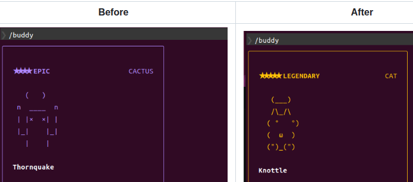

# 砍掉重練你嘅 Claude Code 寵物



> 基於 Claude Code v2.1.89，2026 年 4 月。Buddy 系統係 `/buddy` command 嘅一部分。

---

## 你隻寵物點嚟㗎？

你打 `/buddy`，Claude Code 就會幫你「孵」一隻寵物。但其實佢唔係隨機抽嘅 — **你嘅帳號 ID 一早就決定咗你會攞到咩**。好似你嘅身份證號碼決定咗你隻寵物係咩咁。

### 第一步：搵出你係邊個

Claude Code 會睇你個 config（`~/.claude.json`），用呢個優先順序搵你嘅身份：

```
oauthAccount.accountUuid  →  搵到就用呢個
        搵唔到？
    userID  →  用呢個
        都冇？
    "anon"  →  用匿名
```

如果你用緊 Team Plan，你一定有 `accountUuid`，所以佢永遠用呢個。你改 `userID` 改到天荒地老都冇用 — 佢根本唔睇。

呢個就係我哋踩嘅第一個坑。

### 第二步：攪碎你個 ID

搵到你個 ID 之後，佢會加一個鹽（salt）喺後面：

```
"你個ID" + "friend-2026-401"
```

`friend-2026-401` 就係 4 月 1 號 April Fools 嘅意思 — 呢個系統係愚人節推出嘅。

然後用 **FNV-1a** 呢個 hash function 將成串嘢攪碎成一個 32-bit 數字。好似攪拌機咁 — 你放乜入去就出乜，但你睇個結果係睇唔返原本放咗乜。

### 第三步：用呢個數字做種子

嗰個 hash 數字會餵入去一個叫 **Mulberry32** 嘅偽隨機數產生器（PRNG）。你可以當佢係一部老虎機 — 你放一粒種子入去，佢就會一直吐數字出嚟。**同一粒種子，永遠吐同一串數字。**

### 第四步：逐樣 roll

部老虎機開始吐數字，每粒數字決定一樣嘢：

| 第幾次拉 | 決定咩 | 點 roll |
|----------|--------|---------|
| 第 1 次 | **稀有度** | common 60%、uncommon 25%、rare 10%、epic 4%、**legendary 1%** |
| 第 2 次 | **物種** | 18 隻入面隨機揀一隻（duck、cat、dragon、chonk...） |
| 第 3 次 | **眼睛** | 6 款：`·` `✦` `×` `◉` `@` `°` |
| 第 4 次 | **帽** | common 冇帽，其他有 8 款（crown、wizard、tinyduck...） |
| 第 5 次 | **閃唔閃** | 1% 機率係 shiny |
| 之後 | **Stats** | DEBUGGING、PATIENCE、CHAOS、WISDOM、SNARK 五項能力值 |

所以你嘅 ID → hash → 種子 → 永遠出同一隻寵物。**冇隨機成分，全部係命中注定。**

---

## 孵出嚟之後存咗啲咩？

呢度好重要。你嘅 `~/.claude.json` 入面嘅 `companion` 字段**只係存三樣嘢**：

```json
{
  "companion": {
    "name": "Knottle",
    "personality": "A mottled tabby that thrashes through your code...",
    "hatchedAt": 1775065535831
  }
}
```

就係**名、性格描述、孵化時間**。完。

稀有度、物種、眼睛、帽、閃唔閃、stats — **全部冇存**。每次 Claude Code 開啟，佢都會用你個 ID 重新計算一次。源碼 comment 寫得好直白：

> *「用戶唔可以靠改 config 改到一隻 legendary 出嚟。」*

所以你就算手動改 `"rarity": "legendary"` 入去 config，下一秒佢讀嘅時候就會覆蓋返。

---

## 名同性格點嚟？

孵嘅時候，Claude Code 會將你隻寵物嘅 stats 同一個 `inspirationSeed`（都係由你個 ID 算出嚟嘅）送去 AI model，叫佢：

> *「Generate a companion. Make it memorable and distinct.」*

AI 就會根據你嘅 stats 生成名同性格。例如你隻 Knottle 嘅 CHAOS 係 100，所以佢嘅性格係「thrashes through your code like a ball of yarn」— 好亂嚟嘅感覺。

**每次重新孵都會生成新嘅名同性格**（因為 AI 每次生成都唔同），但物種同稀有度永遠一樣。

---

## 隻寵物識做啲咩？

### 佢會睇你 code 然後講嘢

每次 Claude 回覆完你之後，系統會將你最近嘅對話（最多 5000 字）送去一個 API：

```
POST /api/organizations/{orgId}/claude_code/buddy_react
```

Server 會回一句話，顯示喺佢個 speech bubble 入面。所以佢唔係靜態擺設 — 佢真係會對你嘅 code 有反應。

但注意：**呢個唔係 Claude 講嘅嘢**。Buddy 同 Claude 係兩個獨立嘅系統。Claude 嘅 system prompt 入面有寫：

> *「你唔係 Knottle — 佢係一個獨立嘅觀察者。當用戶叫 Knottle 嘅名嘅時候，佢個 bubble 會答。你嘅工作係退後。」*

### 你可以摸佢

打 `/buddy pet`，佢會跳幾下，頭頂會飄愛心，維持 2.5 秒。冇任何永久效果，純粹開心。

### 你可以靜音佢

打 `/buddy off` 靜音，`/buddy on` 開返。

---

## 動畫點運作？

每隻物種有 3 frame 嘅 ASCII art 動畫：

- **Frame 0**：休息（大部分時間）
- **Frame 1**：小動作（fidget）
- **Frame 2**：特殊效果（龍噴煙、鬼浮起、機械人天線閃）

每 **500ms** 行一個 tick。Idle 嘅時候佢會跟住一個 pattern：
```
[休息, 休息, 休息, 休息, 動, 休息, 休息, 休息, 眨眼, 休息, 休息, 特殊, 休息, 休息, 休息]
```

有人同佢講嘢或者被 pet 嘅時候，佢會加速循環所有 frames，好似好興奮咁。

Speech bubble 會顯示 **~10 秒**，最後 **~3 秒**會慢慢 fade（變暗），提示你佢就嚟消失。

如果你個 terminal 窄過 100 columns，成隻寵物會縮成一行，例如 cat 就變 `=·ω·=`。

---

## 有冇進化？有冇升級？

**冇。完全冇。**

- 冇 XP、冇 level、冇 evolution
- Stats 係固定嘅，由你個 ID hash 決定，永遠唔變
- `/buddy pet` 唔會加 stats
- 同佢互動唔會解鎖任何嘢

佢本質上係一隻**會講嘢嘅 ASCII art 裝飾品**，會睇你 code 然後吐槽你。

---

## Anthropic 可以隨時關

成個系統被 `feature('BUDDY')` 呢個 feature flag 控制住。Anthropic server 端一 flip 呢個 flag，所有人嘅寵物即刻消失。唔需要 update、唔需要 patch — 直接冇咗。

---

## 所以我哋做咗啲咩？

1. 用 brute-force 搵到一個 `userID`，佢嘅 hash → 種子 → roll 出 legendary cat
2. 發現 `accountUuid` 會覆蓋 `userID`，所以改 `userID` 冇用
3. 刪走 `accountUuid`，令系統 fallback 用我哋嘅 `userID`
4. 加咗個 shell alias，每次開 Claude Code 自動刪 `accountUuid`，永久保護

簡單講就係：**我哋唔係改寵物，我哋係改「邊個身份用嚟 roll 寵物」。**

---

## 點樣砍掉重練

詳細步驟同工具請睇英文版 [README.md](README.md)。

---

## License

MIT
